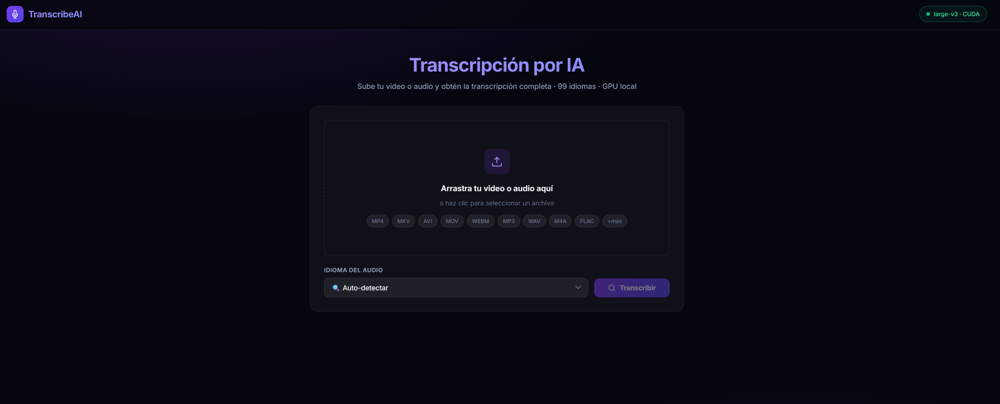

# TranscribeAI 🎙️

Servidor local de transcripción de video y audio con IA. Usa [Whisper](https://github.com/openai/whisper) de OpenAI acelerado por GPU para transcribir cualquier video o audio en 99 idiomas, completamente **gratis** y **sin enviar datos a ningún servidor externo**.



---

## Características

- **GPU local** — usa tu NVIDIA (CUDA) para transcribir en minutos en vez de horas
- **99 idiomas** — detección automática o selección manual
- **Todos los formatos** — MP4, MKV, AVI, MOV, WEBM, MP3, WAV, M4A, FLAC, OGG...
- **Exporta a `.txt` y `.srt`** — subtítulos listos para VLC, YouTube, Premiere
- **Acceso en red local** — úsalo desde cualquier PC de tu red con la IP de tu máquina
- **Sin API keys ni internet** — todo corre en tu equipo
- **Interfaz moderna** — drag & drop, vista con timestamps, copiar al portapapeles

---

## Requisitos

| Requisito | Versión mínima |
|-----------|---------------|
| Python | 3.13+ |
| NVIDIA GPU | Cualquier GPU con CUDA 12.x (RTX recomendado) |
| CUDA Toolkit | 12.x |
| ffmpeg | Cualquier versión reciente |
| RAM | 8 GB (16 GB recomendado para modelo large) |
| VRAM | 4 GB mínimo (8 GB para `large-v3`) |

> También funciona en **CPU** si no tienes GPU NVIDIA, pero es mucho más lento.

---

## Instalación

### 1. Clona el repositorio

```bash
git clone https://github.com/TU_USUARIO/transcribeai.git
cd transcribeai
```

### 2. Instala ffmpeg

```powershell
winget install Gyan.FFmpeg
```

O descárgalo manualmente desde [ffmpeg.org](https://ffmpeg.org/download.html) y añádelo al PATH.

### 3. Instala las dependencias

```powershell
# Crea el entorno virtual con Python 3.13
py -3.13 -m venv env313

# Instala PyTorch con CUDA 12.6 (GPU NVIDIA)
.\env313\Scripts\pip install torch --index-url https://download.pytorch.org/whl/cu126

# Instala el resto de dependencias
.\env313\Scripts\pip install faster-whisper fastapi "uvicorn[standard]" python-multipart
```

> **Sin GPU:** sustituye la línea de torch por `.\env313\Scripts\pip install torch`

---

## Uso

### Arrancar el servidor

```powershell
start.bat
```

O manualmente:

```powershell
.\env313\Scripts\activate
python server.py
```

El servidor arranca en:
- **Local:** http://localhost:8000
- **Red local:** http://`<tu-ip>`:8000

### Primera vez

Al arrancar por primera vez, Whisper descarga el modelo `large-v3` (~1.6 GB). Esto solo ocurre una vez. La interfaz muestra *"Cargando modelo..."* hasta que esté listo (~1-2 minutos).

### Transcribir un video

1. Abre http://localhost:8000 en el navegador
2. Arrastra tu video o haz clic para seleccionarlo
3. Elige el idioma (o deja *Auto-detectar*)
4. Pulsa **Transcribir**
5. Descarga el resultado en `.txt` o `.srt`

---

## Configuración

### Cambiar el modelo

Edita `start.bat` y añade antes de `python server.py`:

```bat
set WHISPER_MODEL=medium
```

| Modelo | VRAM | Velocidad | Calidad |
|--------|------|-----------|---------|
| `tiny` | ~1 GB | ⚡⚡⚡⚡ | ★★☆☆☆ |
| `base` | ~1 GB | ⚡⚡⚡⚡ | ★★★☆☆ |
| `small` | ~2 GB | ⚡⚡⚡ | ★★★☆☆ |
| `medium` | ~3 GB | ⚡⚡ | ★★★★☆ |
| `large-v3` | ~4 GB | ⚡ | ★★★★★ |

### Cambiar el dispositivo

```bat
set WHISPER_DEVICE=cpu   # forzar CPU
set WHISPER_DEVICE=cuda  # forzar GPU
set WHISPER_DEVICE=auto  # automático (por defecto)
```

### Cambiar el puerto

Edita `server.py`, última línea:

```python
uvicorn.run(app, host="0.0.0.0", port=8080)  # cambia 8000 por el que quieras
```

---

## Estructura del proyecto

```
transcribeai/
├── server.py          # Backend FastAPI + lógica de transcripción
├── static/
│   └── index.html     # Frontend (interfaz web completa)
├── requirements.txt   # Dependencias (sin PyTorch, se instala aparte)
├── start.bat          # Arrancar el servidor
├── install.bat        # Instalación automática (Windows)
└── uploads/           # Carpeta temporal de archivos (se ignora en git)
```

---

## Privacidad y seguridad

- Los videos se procesan **localmente** en tu máquina
- Los archivos subidos se **borran automáticamente** tras la transcripción
- No se envía ningún dato a servidores externos
- La carpeta `uploads/` está en `.gitignore` para evitar subir archivos por error

---

## Tecnologías

- [faster-whisper](https://github.com/SYSTRAN/faster-whisper) — motor de transcripción optimizado con CTranslate2
- [FastAPI](https://fastapi.tiangolo.com/) — backend web asíncrono
- [PyTorch](https://pytorch.org/) — detección y acceso a GPU CUDA
- HTML/CSS/JS puro — frontend sin frameworks, carga instantánea

---

## Licencia

MIT — úsalo, modifícalo y distribúyelo libremente.
